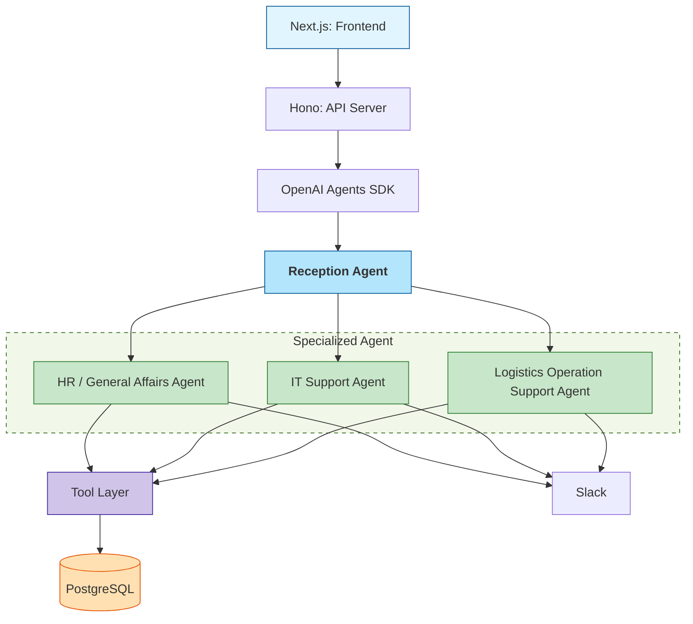

# Appication overall architect design

Prompt: Hãy build source base cho app với cấu trúc như sau:
## Overall architect

## Techstack
### Frontend
| Component  | Tech            |
| ---------- | --------------- |
| Framework  | Next.js 15      |
| Language   | TypeScript 5.6  |
| UI         | TailwindCSS     |
| API client | Orval generated |

### Backend

| Component            | Tech           |
| -------------------- | -------------- |
| Runtime              | Node.js 22 LTS |
| Framework            | Hono 4.5       |
| Language             | TypeScript 5.6 |
| Validation           | Zod            |
| API Spec             | OpenAPI 3.1    |
| API Client Generator | Orval          |

### AI Layer
| Component | Tech              |
| --------- | ----------------- |
| SDK       | OpenAI Agents SDK |
| LLM       | GPT-4.1-mini      |

### Database

| Purpose        | Tech          |
| -------------- | ------------- |
| Operational DB | PostgreSQL 16 |
| Cache          | built-in      |
| Vector Search  | pgvector      |

### Notification
| Purpose | Tech      |
| ------- | --------- |
| ChatOps | Slack API |

## Folder structure

project-root/

apps/
 ├── frontend/
 └── backend/

packages/
 ├── shared-types/
 ├── openapi/
 └── agents/

apps/backend/src/

 ├── routes/
 ├── agents/
 │    ├── reception/
 │    ├── hr/
 │    ├── it/
 │    └── accounting/
 │
 ├── tools/
 ├── services/
 ├── schemas/
 └── db/