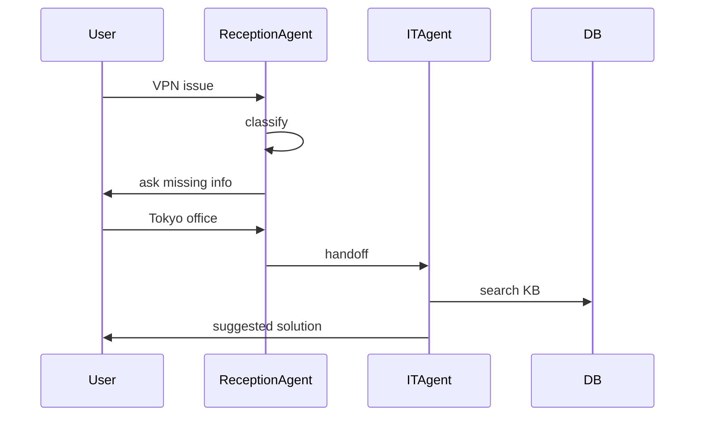


## Reception Agent
Responsibility
- classify inquiry
- ask missing info
- decide handoff

## Specialized Agent
### IT Support Agent
Handle inquiry liên quan:
- VPN không vào được
- Laptop lỗi
- Không login SAP/WMS
- Slack/Teams lỗi
- Password reset
- Permission request
1. Flow
- search KB
- create incident
- notify IT team
### Logistics Operation Support Agent
Handle inquiry liên quan:
- shipment
- warehouse
- delivery
- delay
- inventory
- transport issue

### HR / General Affairs Agent
Handle inquiry liên quan:

- HR inquiry
- policy
- expense
- leave
- onboarding
- company rules
## Agent Orchestration

