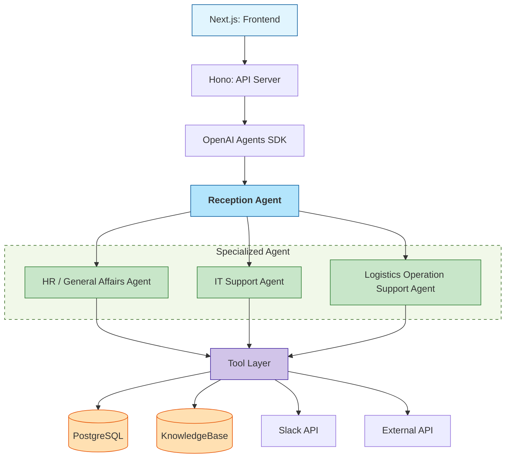

Appication overall architect design

# Overview

The system is a multi-agent AI platform for logistics operations.
Users interact with a Reception Agent (RA) through chat.
The Reception Agent gathers information, classifies requests, and delegates tasks to appropriate Specialized Agents (SA).

Specialized Agents interact with:
- Database
- External APIs
- Internal tools

If the request cannot be resolved automatically, the system escalates the issue to a human operator via Slack.

# High-Level Architecture



# Core Components

## Frontend
Technology
| Component  | Tech            |
| ---------- | --------------- |
| Framework  | Next.js         |
| Language   | TypeScript      |
| UI         | TailwindCSS     |
| API client | Orval generated |
Responsibilities
- Chat UI
- Conversation history
- Streaming AI response

## Backend
Technology

| Component            | Tech       |
| -------------------- | ---------- |
| Runtime              | Node.js    |
| Framework            | Hono       |
| Language             | TypeScript |
| Validation           | Zod        |
| API Spec             | OpenAPI    |
| API Client Generator | Orval      |

Responsibilities
- API endpoint management
- Session management
- Agent orchestration entrypoint
- Logging
- Error handling

## AI Layer
| Component | Tech              |
| --------- | ----------------- |
| SDK       | OpenAI Agents SDK |
| LLM       | GPT-4.1-mini      |

## Database

| Purpose        | Tech          |
| -------------- | ------------- |
| Operational DB | PostgreSQL 16 |
| Cache          | built-in      |
| Vector Search  | pgvector      |

Responsibilities
- Store conversations
- Store shipment data
- Store inventory data
- Audit logs

## Slack Escalation
| Purpose | Tech      |
| ------- | --------- |
| ChatOps | Slack API |

Responsibilities
- Notify human operators
- Handle unresolved requests
- Report critical failures

Trigger Conditions
- Agent confidence too low
- Missing required data
- Tool execution failure
- Retry exceeded

## Tools Layer
Responsibilities
- Database access
- External API integration
- Deterministic operations

Examples
- getShipmentStatus()
- searchInventory()
- createExportRequest()

# Folder structure
```text
project-root/

apps/
 ├── frontend/
 └── backend/

packages/
 ├── shared-types/
 ├── openapi/
 └── agents/

apps/backend/src/

 ├── routes/
 ├── agents/
 │    ├── reception/
 │    ├── it-support/
 │    ├── logistics/
 │    └── hr/
 │
 ├── tools/
 │   ├── shipment/
 │   ├── inventory/
 │   ├── slack/
 │   └── kb/
 ├── workflows/
 ├── contracts/
 ├── services/
 ├── schemas/
 └── database/
```

