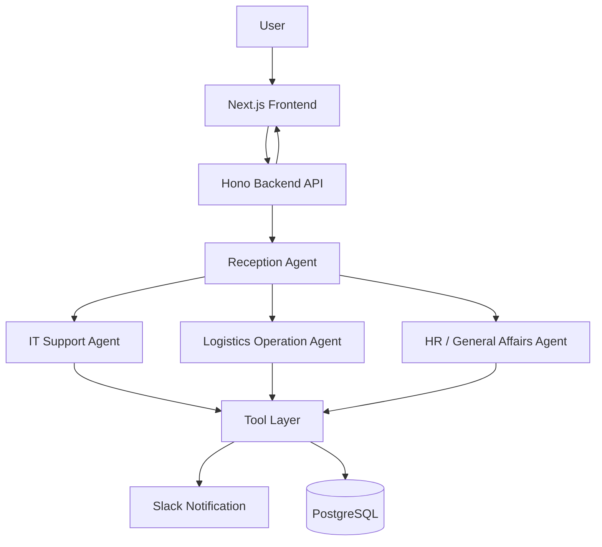
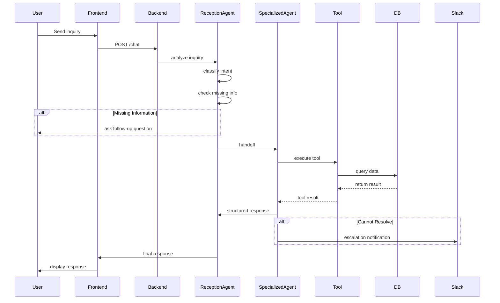
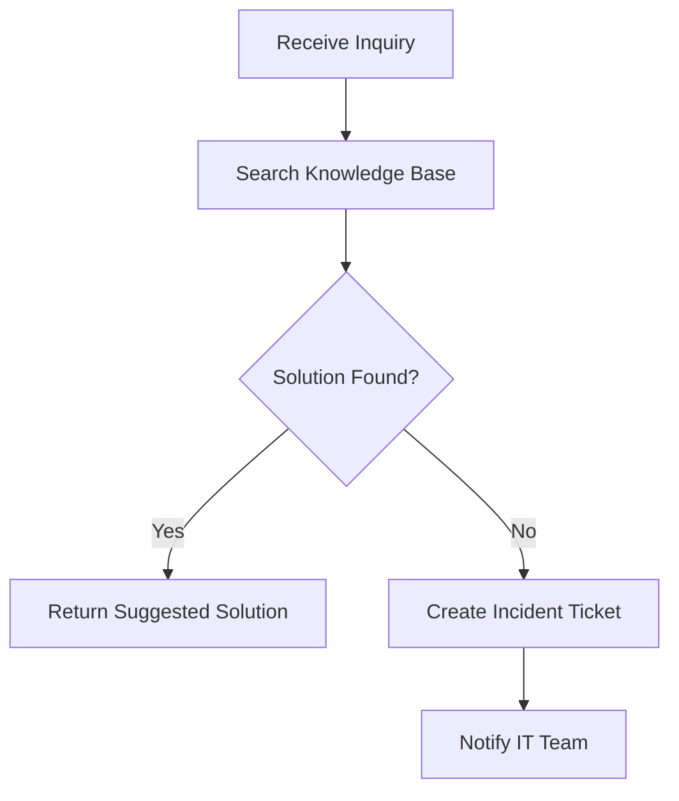
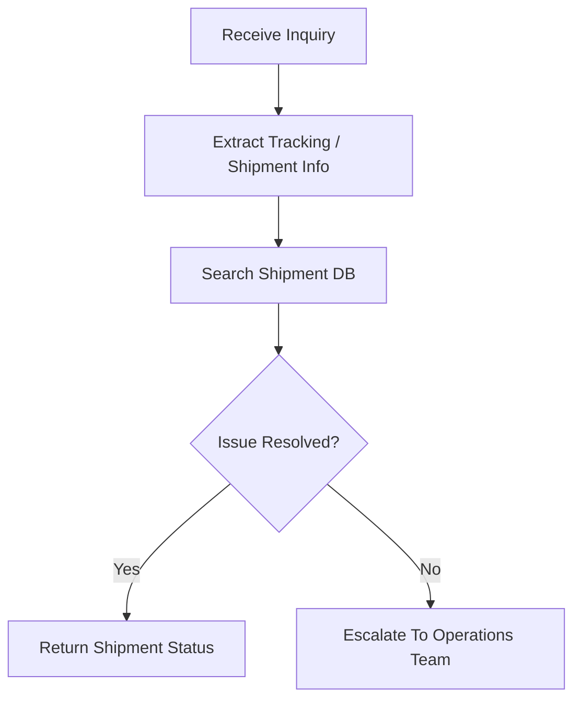
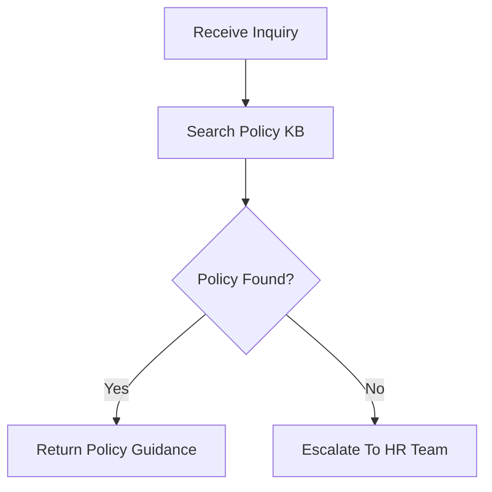

# Logistics Agent System Design

# 1. System Overview

The system is a multi-agent AI platform for enterprise internal inquiry handling.

Main objectives:

* Reduce manual support workload
* Automate inquiry classification
* Delegate requests to domain-specific agents
* Escalate unresolved issues to human operators

---

# 2. Architecture Overview



---

# 3. Request Lifecycle



---

# 4. Agent Responsibility Matrix

| Agent                      | Responsibility                        | Example        |
| -------------------------- | ------------------------------------- | -------------- |
| Reception Agent            | Intent classification & orchestration | Route inquiry  |
| IT Support Agent           | IT troubleshooting                    | VPN issue      |
| Logistics Operation Agent  | Logistics support                     | Shipment delay |
| HR / General Affairs Agent | HR & internal policy                  | Expense rule   |

---

# 5. Reception Agent Design

---

## 5.1 Responsibilities

### Main Responsibilities

* Receive inquiry
* Detect user intent
* Extract entities
* Detect missing information
* Ask follow-up questions
* Select Specialized Agent
* Handle escalation routing

---


## 5.4 Intent Classification Rules

| Intent              | Keywords                      |
| ------------------- | ----------------------------- |
| it_support          | vpn, laptop, password, SAP    |
| logistics_operation | shipment, delivery, warehouse |
| hr_general_affairs  | leave, onboarding, expense    |

---

## 5.5 Missing Information Detection

Examples:

| Inquiry        | Missing Information |
| -------------- | ------------------- |
| VPN issue      | office location     |
| Shipment delay | tracking number     |
| Expense issue  | expense ID          |

---

## 5.6 Prompt Template

```md
# Role
You are a Reception Agent for enterprise inquiry handling.

# Responsibilities
- Understand user inquiry
- Identify inquiry category
- Detect missing information
- Ask concise follow-up questions
- Route inquiry to proper specialized agent

# Constraints
- Do not provide domain-specific solutions if the confidence
- Do not hallucinate information
- Keep responses concise

# Escalation Conditions
- Confidence < 0.6
- Unknown inquiry type
- Sensitive request

# Response Format
JSON
```

---

# 6. Specialized Agent Design

---

# 6.1 IT Support Agent

---

## Responsibilities

Handle:

* VPN issue
* Laptop issue
* SAP/WMS login issue
* Slack/Teams issue
* Password reset
* Permission request

---

## Workflow



---

## Tools

| Tool                | Purpose                      |
| ------------------- | ---------------------------- |
| searchKnowledgeBase | Search troubleshooting guide |
| createIncident      | Create support ticket        |
| notifySlack         | Notify IT team               |

---

## Escalation Conditions

* KB search failed
* User issue unresolved
* System outage
* Permission/security issue

---

## Prompt Template

```md
# Role
You are an IT Support Agent.

# Goal
Resolve IT-related inquiries using KB and tools.

# Constraints
- Do not invent technical procedures
- Use KB first
- Escalate security-related issues

# Response Format
Structured JSON
```

---

# 6.2 Logistics Operation Support Agent

---

## Responsibilities

Handle:

* shipment
* warehouse
* delivery
* delay
* inventory
* transport issue

---

## Workflow



---

## Tools

| Tool            | Purpose           |
| --------------- | ----------------- |
| searchShipment  | Shipment search   |
| searchInventory | Inventory inquiry |
| notifySlack     | Escalation        |

---

## Escalation Conditions

* Shipment not found
* Delay over threshold
* Warehouse incident
* Data inconsistency

---

## Prompt Template

```md
# Role
You are a Logistics Operation Support Agent.

# Goal
Provide logistics operation support.

# Constraints
- Always verify shipment information
- Never fabricate tracking status
- Escalate unresolved operational issues

# Response Format
Structured JSON
```

---

# 6.3 HR / General Affairs Agent

---

## Responsibilities

Handle:

* HR inquiry
* company policy
* expense
* leave
* onboarding
* company rules

---

## Workflow



---

## Tools

| Tool              | Purpose          |
| ----------------- | ---------------- |
| searchPolicy      | Search policy KB |
| searchExpenseRule | Expense policy   |
| notifySlack       | HR escalation    |

---

## Escalation Conditions

* Legal issue
* Sensitive HR issue
* Policy ambiguity

---
# Agent Contracts Design


## Recommended File Structure

```text
contracts/
├── agent-contracts.ts
├── handoff-contracts.ts
├── tool-contracts.ts
├── escalation-contracts.ts
├── state-contracts.ts
└── message-contracts.ts
```

---

# 1. Base Message Contracts

## File

```text
contracts/message-contracts.ts
```

---

## Purpose

Standardize all chat messages exchanged between:

* user
* agents
* tools
* system

---

## Design

```ts
export type MessageRole =
  | "user"
  | "assistant"
  | "system"
  | "tool"
  | "agent";

export interface Message {
  id: string;
  role: MessageRole;
  content: string;
  createdAt: string;
  metadata?: Record<string, unknown>;
}
```

---

# 2. Agent Base Contracts

## File

```text
contracts/agent-contracts.ts
```

---

# 2.1 Agent Type

```ts
export type AgentType =
  | "reception_agent"
  | "it_support_agent"
  | "logistics_operation_agent"
  | "hr_general_affairs_agent";
```

---

# 2.2 Intent Type

```ts
export type IntentType =
  | "it_support"
  | "logistics_operation"
  | "hr_general_affairs"
  | "unknown";
```

---

# 2.3 Agent Status

```ts
export type AgentExecutionStatus =
  | "success"
  | "failed"
  | "requires_followup"
  | "requires_escalation";
```

---

# 2.4 Base Agent Request

All agents inherit from this structure.

```ts
export interface BaseAgentRequest {
  sessionId: string;
  userId: string;
  message: string;
  conversationHistory: Message[];
  metadata?: Record<string, unknown>;
}
```

---

# 2.5 Base Agent Response

```ts
export interface BaseAgentResponse {
  status: AgentExecutionStatus;
  responseMessage: string;
  confidence?: number;
  escalationRequired?: boolean;
  metadata?: Record<string, unknown>;
}
```

---

# 3. Reception Agent Contracts

---

# 3.1 Reception Agent Input

```ts
export interface ReceptionAgentInput
  extends BaseAgentRequest {}
```

---

# 3.2 Reception Agent Output

```ts
export interface ReceptionAgentOutput
  extends BaseAgentResponse {
  intent: IntentType;
  missingInformation?: string[];
  extractedEntities?: Record<string, string>;
  handoffAgent?: AgentType;
}
```

---

# Example

```json
{
  "intent": "it_support",
  "confidence": 0.92,
  "missingInformation": ["office_location"],
  "handoffAgent": "it_support_agent",
  "responseMessage": "Please provide your office location."
}
```

---

# 4. Handoff Contracts

## File

```text
contracts/handoff-contracts.ts
```

---

# Purpose

Standardize communication between agents.

---

# 4.1 Handoff Payload

```ts
export interface AgentHandoffPayload {
  sourceAgent: AgentType;
  targetAgent: AgentType;
  intent: IntentType;
  sessionId: string;
  userId: string;
  message: string;
  extractedEntities?: Record<string, unknown>;
  conversationSummary?: string;
  metadata?: Record<string, unknown>;
}
```

---

# Example

```json
{
  "sourceAgent": "reception_agent",
  "targetAgent": "it_support_agent",
  "intent": "it_support",
  "sessionId": "sess_001",
  "message": "VPN cannot connect",
  "extractedEntities": {
    "office": "Tokyo"
  }
}
```

---

# 5. IT Support Agent Contracts

---

# 5.1 Input

```ts
export interface ITSupportAgentRequest
  extends BaseAgentRequest {
  issueType?: string;
  office?: string;
  device?: string;
  application?: string;
  errorMessage?: string;
}
```

---

# 5.2 Output

```ts
export interface ITSupportAgentResponse
  extends BaseAgentResponse {
  resolved: boolean;
  suggestedSolution?: string;
  kbArticleIds?: string[];
  incidentId?: string;
}
```

---

# Example

```json
{
  "status": "success",
  "resolved": true,
  "suggestedSolution": "Reconnect VPN after resetting password.",
  "kbArticleIds": ["KB-IT-001"]
}
```

---

# 6. Logistics Operation Agent Contracts

---

# 6.1 Input

```ts
export interface LogisticsOperationAgentRequest
  extends BaseAgentRequest {
  trackingNumber?: string;
  warehouseCode?: string;
  shipmentId?: string;
  inventoryItemCode?: string;
}
```

---

# 6.2 Output

```ts
export interface LogisticsOperationAgentResponse
  extends BaseAgentResponse {
  shipmentStatus?: string;
  currentLocation?: string;
  estimatedArrival?: string;
  inventoryQuantity?: number;
  operationalIssueDetected?: boolean;
}
```

---

# Example

```json
{
  "status": "success",
  "shipmentStatus": "DELAYED",
  "currentLocation": "Nagoya Hub",
  "estimatedArrival": "2026-05-15T10:00:00Z"
}
```

---

# 7. HR / General Affairs Agent Contracts

---

# 7.1 Input

```ts
export interface HRGeneralAffairsAgentRequest
  extends BaseAgentRequest {
  employeeId?: string;
  inquiryCategory?: string;
  expenseId?: string;
}
```

---

# 7.2 Output

```ts
export interface HRGeneralAffairsAgentResponse
  extends BaseAgentResponse {
  policyFound?: boolean;
  policyTitle?: string;
  policySummary?: string;
  escalationRequired?: boolean;
}
```

---


# 10. Conversation State Contracts

## File

```text
contracts/state-contracts.ts
```

---

# Purpose

Store orchestration state.

Useful for:

* workflow persistence
* retry
* recovery

---


# 11. Recommended Enum Centralization

## File

```text
contracts/enums.ts
```

---

# Purpose

Prevent magic strings.

---

# Example

```ts
export enum ShipmentStatus {
  PENDING = "PENDING",
  IN_TRANSIT = "IN_TRANSIT",
  DELAYED = "DELAYED",
  DELIVERED = "DELIVERED"
}
```

---
