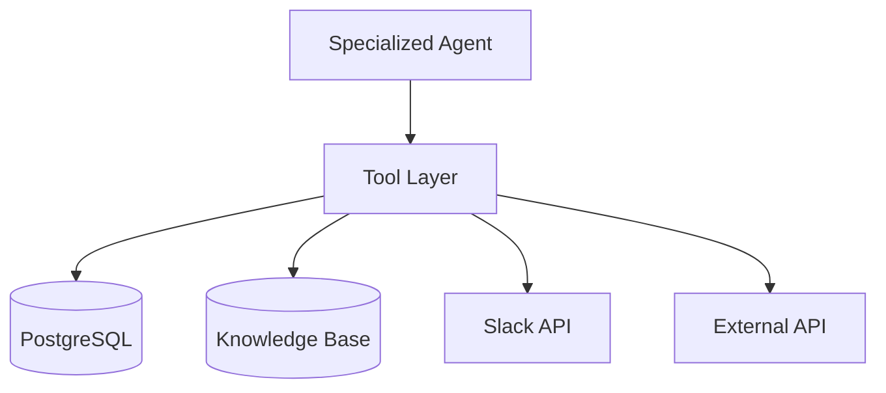

# Tool Layer Design

The Tool Layer provides deterministic operations for Specialized Agents.

Design principles:

* No reasoning inside tools
* Pure input/output execution
* Structured response only
* Reusable across agents
* Easy to mock/test
* Strong TypeScript contracts

---

# Tool Architecture



---

# Recommended Folder Structure

```text
backend/
„¥„Ÿ„Ÿ tools/
„    „¥„Ÿ„Ÿ shipment/
„    „    „¤„Ÿ„Ÿ get-shipment-status.tool.ts
„    „ 
„    „¥„Ÿ„Ÿ inventory/
„    „    „¤„Ÿ„Ÿ search-inventory.tool.ts
„    „ 
„    „¥„Ÿ„Ÿ knowledge/
„    „    „¤„Ÿ„Ÿ search-knowledge.tool.ts
„    „ 
„    „¥„Ÿ„Ÿ policy/
„    „    „¥„Ÿ„Ÿ search-policy.tool.ts
„    „    „¤„Ÿ„Ÿ search-expense-rule.tool.ts
„    „ 
„    „¥„Ÿ„Ÿ incident/
„    „    „¤„Ÿ„Ÿ create-incident.tool.ts
„    „ 
„    „¤„Ÿ„Ÿ slack/
„        „¤„Ÿ„Ÿ notify-slack.tool.ts
```

---

# contracts/tool-contracts.ts

---

# 1. Common Tool Contracts

---

## 1.1 Tool Execution Status

```ts
export type ToolExecutionStatus =
  | "success"
  | "failed";
```

---

## 1.2 Base Tool Result

```ts
export interface ToolResult<T> {
  success: boolean;
  data?: T;
  error?: string;
  executionTimeMs?: number;
  metadata?: Record<string, unknown>;
}
```

---

## 1.3 Base Tool Context

Optional execution context.

```ts
export interface ToolExecutionContext {
  sessionId: string;
  userId?: string;
  agentName?: string;
  traceId?: string;
}
```

---

# 2. Shipment Tool Contracts

---

# Tool Name

```text
getShipmentStatus
```

---

# Purpose

Retrieve shipment status information.

Used by:

* Logistics Operation Agent

---

# Input Schema

```ts
export interface GetShipmentStatusInput {
  trackingNumber: string;
}
```

---

# Output Schema

```ts
export interface GetShipmentStatusOutput {
  trackingNumber: string;

  shipmentStatus:
    | "PENDING"
    | "IN_TRANSIT"
    | "DELAYED"
    | "DELIVERED"
    | "CANCELLED";

  currentLocation: string;
  estimatedArrival?: string;
  delayReason?: string;
  lastUpdatedAt: string;
}
```

---

# Example Result

```json
{
  "trackingNumber": "TRK-001",
  "shipmentStatus": "DELAYED",
  "currentLocation": "Nagoya Hub",
  "estimatedArrival": "2026-05-15T10:00:00Z",
  "delayReason": "Weather condition"
}
```

---

# Failure Conditions

* Shipment not found
* Invalid tracking number
* DB timeout

---

# Recommended Tool Signature

```ts
export async function getShipmentStatus(
  input: GetShipmentStatusInput,
  context?: ToolExecutionContext
): Promise<ToolResult<GetShipmentStatusOutput>>
```

---

# 3. Inventory Tool Contracts

---

# Tool Name

```text
searchInventory
```

---

# Purpose

Retrieve warehouse inventory information.

---

# Input Schema

```ts
export interface SearchInventoryInput {
  itemCode?: string;
  itemName?: string;
  warehouseCode?: string;
}
```

---

# Output Schema

```ts
export interface SearchInventoryOutput {
  itemCode: string;
  itemName: string;
  warehouseCode: string;
  availableQuantity: number;
  reservedQuantity: number;
  unit: string;
  updatedAt: string;
}
```

---

# Example Result

```json
{
  "itemCode": "ITEM-001",
  "itemName": "Forklift Battery",
  "warehouseCode": "WH-TYO",
  "availableQuantity": 25,
  "reservedQuantity": 5,
  "unit": "PCS"
}
```

---

# Failure Conditions

* Item not found
* Warehouse not found

---

# Recommended Tool Signature

```ts
export async function searchInventory(
  input: SearchInventoryInput,
  context?: ToolExecutionContext
): Promise<ToolResult<SearchInventoryOutput[]>>
```

---

# 4. Knowledge Base Tool Contracts

---

# Tool Name

```text
searchKnowledgeBase
```

---

# Purpose

Search troubleshooting guides and enterprise knowledge base.

Used by:

* IT Support Agent
* HR Agent
* Reception Agent

---

# Input Schema

```ts
export interface SearchKnowledgeInput {
  query: string;

  category?:
    | "it_support"
    | "logistics"
    | "hr";
  language?: string;
  limit?: number;
}
```

---

# Output Schema

```ts
export interface KnowledgeDocument {
  id: string;
  title: string;
  summary: string;
  category: string;
  content: string;
  score?: number;
  sourceUrl?: string;
  updatedAt?: string;
}
```

---

# Example Result

```json
{
  "id": "KB-IT-001",
  "title": "VPN Troubleshooting Guide",
  "summary": "Steps to reconnect VPN",
  "category": "it_support",
  "score": 0.92
}
```

---

# Failure Conditions

* KB unavailable
* No matching document

---

# Recommended Tool Signature

```ts
export async function searchKnowledgeBase(
  input: SearchKnowledgeInput,
  context?: ToolExecutionContext
): Promise<ToolResult<KnowledgeDocument[]>>
```

---

# 5. Policy Search Tool Contracts

---

# Tool Name

```text
searchPolicy
```

---

# Purpose

Search HR/company policy documents.

---

# Input Schema

```ts
export interface SearchPolicyInput {
  query: string;
  category?: string;
  language?: string;
}
```

---

# Output Schema

```ts
export interface SearchPolicyOutput {
  policyId: string;
  title: string;
  summary: string;
  effectiveDate?: string;
  documentUrl?: string;
}
```

---

# Example Result

```json
{
  "policyId": "HR-LEAVE-001",
  "title": "Annual Leave Policy",
  "summary": "Employees are entitled to 20 paid leave days."
}
```

---

# Recommended Tool Signature

```ts
export async function searchPolicy(
  input: SearchPolicyInput,
  context?: ToolExecutionContext
): Promise<ToolResult<SearchPolicyOutput[]>>
```

---

# 6. Expense Rule Tool Contracts

---

# Tool Name

```text
searchExpenseRule
```

---

# Purpose

Retrieve expense reimbursement rules.

---

# Input Schema

```ts
export interface SearchExpenseRuleInput {
  expenseCategory: string;
  officeLocation?: string;
}
```

---

# Output Schema

```ts
export interface SearchExpenseRuleOutput {
  expenseCategory: string;
  maxAmount?: number;
  currency?: string;
  approvalRequired: boolean;
  summary: string;
}
```

---

# Example Result

```json
{
  "expenseCategory": "Transportation",
  "maxAmount": 300,
  "currency": "USD",
  "approvalRequired": false,
  "summary": "Taxi reimbursement up to 300 USD."
}
```

---

# Recommended Tool Signature

```ts
export async function searchExpenseRule(
  input: SearchExpenseRuleInput,
  context?: ToolExecutionContext
): Promise<ToolResult<SearchExpenseRuleOutput>>
```

---

# 7. Slack Notification Tool Contracts

---

# Tool Name

```text
notifySlack
```

---

# Purpose

Send escalation notifications to Slack.

---

# Input Schema

```ts
export interface NotifySlackInput {
  channel: string;

  priority:
    | "LOW"
    | "MEDIUM"
    | "HIGH";

  title: string;
  message: string;
  sessionId: string;
  mentionUsers?: string[];
}
```

---

# Output Schema

```ts
export interface NotifySlackOutput {
  success: boolean;
  slackChannel: string;
  threadTs?: string;
  sentAt: string;
}
```

---

# Example Result

```json
{
  "success": true,
  "slackChannel": "#it-support",
  "threadTs": "1745634343.0002"
}
```

---

# Failure Conditions

* Slack API unavailable
* Invalid channel

---

# Recommended Tool Signature

```ts
export async function notifySlack(
  input: NotifySlackInput,
  context?: ToolExecutionContext
): Promise<ToolResult<NotifySlackOutput>>
```

---

# 8. Incident Tool Contracts

---

# Tool Name

```text
createIncident
```

---

# Purpose

Create IT support incident ticket.

---

# Input Schema

```ts
export interface CreateIncidentInput {
  category: string;

  priority:
    | "LOW"
    | "MEDIUM"
    | "HIGH";

  summary: string;
  description?: string;
  createdBy: string;
  relatedSessionId?: string;
}
```

---

# Output Schema

```ts
export interface CreateIncidentOutput {
  incidentId: string;
  incidentNumber: string;
  status:
    | "OPEN"
    | "IN_PROGRESS";
  createdAt: string;
}
```

---

# Example Result

```json
{
  "incidentId": "inc-001",
  "incidentNumber": "IT-2026-001",
  "status": "OPEN"
}
```

---

# Failure Conditions

* Incident DB unavailable
* Invalid category

---

# Recommended Tool Signature

```ts
export async function createIncident(
  input: CreateIncidentInput,
  context?: ToolExecutionContext
): Promise<ToolResult<CreateIncidentOutput>>
```

---